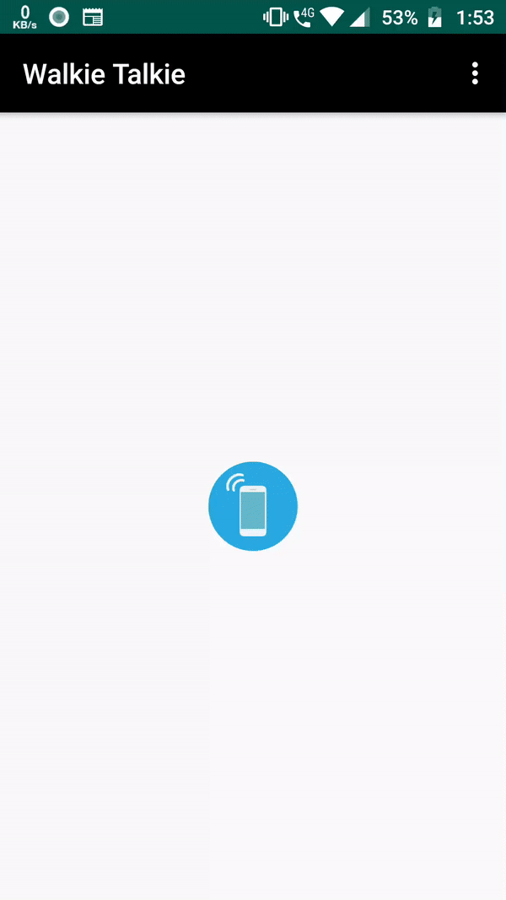

# Walkie-Talkie

Walkie-talkie allow you to communicate with people without any infrastructure based services like cellular network or Wifi. We make this possible by transferring audio over Wifi-Direct.

## Getting Started

These instructions will get you a copy of the project up and running on your local machine for development and testing purposes. See deployment for notes on how to deploy the project on a live system.

### Prerequisites

What things you need to install the software and how to install them

* [Android Studio](https://developer.android.com/studio)

### Building using Android Studio...
1. Clone this repo
` git clone https://github.com/murtaza98/Walkie-Talkie.git`
2. Goto Android Studio and select Open an existing Android Studio project
3. Select the directory where you cloned the project

### DEMO

## Built With

* [Android](https://developer.android.com/docs) - The mobile platform used
* [Wifi P2P](https://developer.android.com/guide/topics/connectivity/wifip2p) - For establishing a connection using Wifi-Direct.

